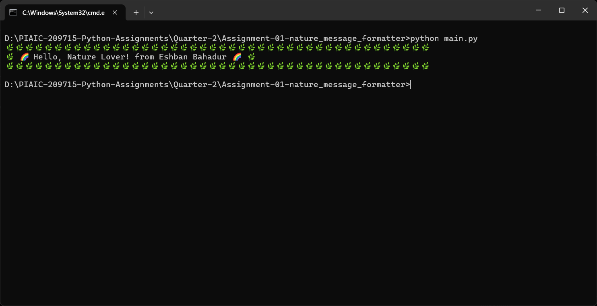

# Nature Message Formatter

This Python package formats text messages with a fun **nature theme** using custom decorators. It adds visual flair to your messages with leafy frames (`🌿`) and rainbow waves (`🌈`).

## Features

- **Leafy Frame**: Surrounds the message with a lush forest border of leaf emojis.
- **Rainbow Wave**: Adds vibrant rainbow emojis before and after the message.

## How to Run the Script

1. Clone this repository or navigate to the project directory:
   ```bash
   cd nature_message_formatter


## Example Output
