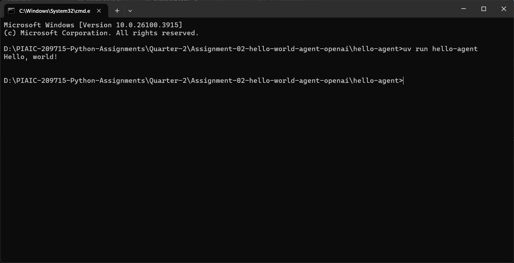

# Hello-World Agent (Gemini)

This project demonstrates a simple Gemini-powered agent using `uv`. The agent responds with a greeting when run.

## Prerequisites

- Python 3.8+ installed
- `uv` CLI installed (`pip install uv`)
- A Gemini API key, set in a `.env` file in the project root:
  ```bash
  echo "GEMINI_API_KEY=YOUR_GEMINI_API_KEY" > .env
  ```

## Step-by-Step Instructions

1. **Clone the repository**

   ```bash
   git clone https://github.com/eshbanbahadur/PIAIC-209715-Python-Assignments.git
   cd PIAIC-209715-Python-Assignments/Quarter-2/Assignment-02-hello-world-agent-openai
   ```

2. **Verify your layout** Ensure you have:

   - `pyproject.toml` at the root
   - `src/hello_agent/agent_hello.py` containing `def my_first_agent():`

3. **Sync the environment**

   ```bash
   uv sync
   ```

   This creates (or updates) the `.venv` folder and installs dependencies, including your package.

4. **Run the agent**

   ```bash
   uv run hello-agent
   ```

   This will load your `GEMINI_API_KEY` from the `.env` file and execute the `my_first_agent()` function.

5. **Verify output** You should see a greeting printed to your terminal, for example:

   ```bash
   Hello, world from Gemini!
   ```

## Example Output

You can include your terminal output in two ways:

1. **As an image**:
   
